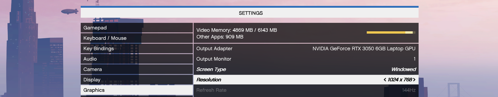

<h1 align="center">GTA V Hand Gesture Control</h1>

Control Grand Theft Auto V (GTA V) using a trained machine learning model and develop a real-time hand gesture recognition and control system. This project uses `OpenCV` and `MediaPipe` for hand tracking, `scikit-learn` for gesture classification, and `pynput` for keyboard/mouse emulation.

## *Click below for full tutorial*

[](https://youtu.be/nDHH-_-eN_k)

## Features

- **Real-time hand gesture recognition** using advanced computer vision and machine learning
- **Custom gesture recording**: Easily define and collect new gestures for any application
- **Customizable action mapping**: Easily assign gestures to any in-game or system action by editing `control.py`
- **User-friendly workflow**: Simple scripts for data collection, model training, and live control.
- **Diverse applications**: Extendable to other games, software, automation, and robotics

## Project Structure

```bash
.
├── record_gesture.py           # Collects gesture samples and saves to CSV
├── dataset.csv                 # Collected gesture data
├── trainer.py                  # Trains a Random Forest model on the collected data
├── model.pkl                   # Trained gesture classification model
├── control.py                  # Main control script
```

## Setup and Installation

> [!IMPORTANT]
> ***Set GTA V to windowed mode and lower the game resolution*** <br><br>
> 

### 1. Clone the repository

```bash
    git clone https://github.com/karmaniket/GtaVControl.git
    cd GtaVControl
```

### 2. Install dependencies

Requirements:

- Python 3.8+
```sh
pip install opencv-python mediapipe numpy scikit-learn pandas pynput joblib
```

### 3. Record gestures

- Press `SPACE` to start/stop collecting samples for each gesture, and `ESC` to exit
- The dataset will be saved as `dataset.csv`

```sh
python record_gesture.py
```

>[!TIP]
> This project uses MediaPipe hand landmarks with normalization and a random forest model. For best results, keep your hand clearly visible in `consistent lighting` while collecting data, hold each gesture briefly and record around 100–200 samples with small natural variations. And with inconsistent lighting, collect additional angles and samples to reduce finger confusion.

### 4. Train the Model

Train a gesture classification model:

```sh
python trainer.py
```
- The trained model will be saved as `model.pkl`

### 5. Control script

- Run the main control script and make sure GTA V is running and focused
- Perform gestures in front of your webcam

```sh
python control.py
```

### 6. Gesture mapping

```bash
    Left        >   A       |   Move left
    Right       >   D       |   Move right
    Forward     >   W       |   Move forward
    Back        >   S       |   Move backward
    Jump        >   SPACE   |   Jump
    Fight       >   L + M   |   Attack
    Enter/Exit  >   F       |   Enter or exit vehicle
    Stop        >   SPACE   |   Stop vehicle
```

## License

This project is licensed under the [MIT License](LICENSE).

You are free to use, modify, and distribute this software, including for commercial purposes, provided that you include the original copyright notice and this license in any copies or substantial portions of the software. This ensures that credit and attribution are always given to the original author.

## Acknowledgement

This project is intended for educational and demonstration purposes only. It is not affiliated with, endorsed by, or associated with Rockstar Games or any of its subsidiaries. All trademarks and copyrights related to Grand Theft Auto V are the property of Rockstar Games. This project is provided under fair use for research and learning.
